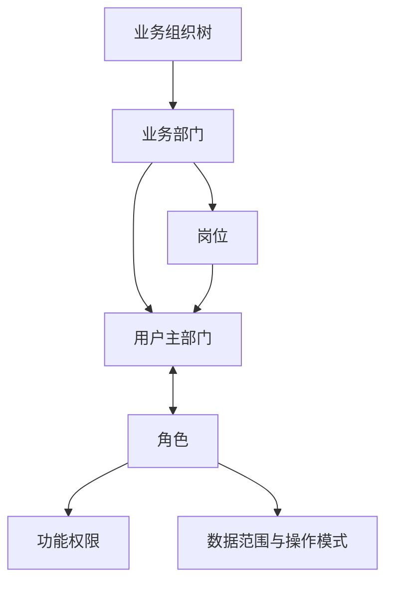

# SRM V1.0 阶段1：平台与数据底座建设开发任务书 V1.0

## 文档控制

| 项目 | 内容 |
| --- | --- |
| 系统名称 | SRM 供应商协同管理系统 |
| 阶段名称 | 阶段1：平台与数据底座建设 |
| 文档版本 | V1.0 |
| 文档状态 | OpenCode 正式开发执行版 |
| 编制日期 | 2026-07-31 |
| 开发执行 | OpenCode 1.18.9 + DeepSeek V4 Pro |
| 开发后复核 | OpenCode 整阶段自复核 |
| 阶段验收 | Codex 技术验收 + 用户业务与页面验收 |
| 设计依据 | 《SRM供应商协同管理系统蓝图与总体设计说明书 V1.0》、`SRM_V1.0分阶段实施与开发任务总表_执行版.xlsx`、仓库根 `AGENTS.md` |

---

## 0. 给 OpenCode 的直接执行指令

你现在负责完成 **SRM V1.0 阶段1：平台与数据底座建设** 的全部开发与自复核。

这是一份单阶段完整任务书，不再拆成多个外部任务包，不启用 Qwen Code、Kimi Code、子 Agent 或多 worktree。你必须在同一阶段分支内按本任务书的 E1-01～E1-07 顺序连续完成数据库、后端、内部前端、测试、部署配置和文档。

执行原则：

1. 先完成第 2 章的只读前置核验；满足条件后直接进入开发，不停留在方案建议或重复规划。
2. 保留阶段0已经实现的认证、JWT、刷新/退出、最小 RBAC、动态菜单、双前端、OpenAPI、MyBatis-Plus、Flyway、Docker Compose 和安全配置，只做增量扩展，不得整体重写。
3. 数据访问继续统一使用 **MyBatis-Plus 3.5.17**；禁止新增任何直接 `JdbcTemplate`、`NamedParameterJdbcTemplate` 或业务层直接 Mapper 依赖。
4. 不得修改已经发布的 `V1～V3`；本阶段只允许新增精确编号的 `V4～V9`。
5. 本阶段必须实现真实可用的平台和主数据能力，但不得提前开发供应商、寻源、合同、供应源、采购、交付、质量、结算、绩效业务。
6. 不得用模拟交易、伪造 KPI、假供应商数据或静态成功页面证明完成。
7. 开发完成后执行本任务书全部自动化检查、真实 MySQL 8.4 升级验证、Docker 五服务联调和隔离恢复演练，并提交一份整阶段开发与自复核报告。
8. 未经用户另行授权，不得执行 `git commit`、`git push`、创建 PR、部署生产、修改服务器、删除数据库或执行 `docker compose down -v`。

---

## 1. 阶段定位

### 1.1 阶段目标

在阶段0工程骨架之上，形成一个真正可用的模块化单体平台，使内部用户能够：

- 登录、退出、刷新会话和修改初始密码；
- 维护集团、公司、事业部、工厂、仓库、部门、岗位和内部用户；
- 以角色为授权主对象挂载用户、菜单、按钮、接口权限和数据权限；
- 使用轻量审批、统一任务、SLA 和站内消息；
- 使用字典、参数、编号、附件、审计、批量导入导出等公共能力；
- 维护或导入采购组织、工厂、仓库、交付地点、物料、品类、单位、币种、税码；
- 查看外部映射、Inbox/Outbox 和接口任务执行状态；
- 在工作台查看本人真实待办、消息、主数据异常和平台运行状态；
- 在隔离环境中完成数据库、附件和配置的备份恢复验证。

### 1.2 阶段出口

阶段1只有在以下结果全部可验证时才允许关闭：

1. 阶段0基线能力无回退，生产源码差异已收口。
2. 内部组织、部门、岗位、用户、角色关系真实可维护。
3. 菜单/按钮/接口权限与数据范围均由后端强制执行。
4. 审批、任务、SLA、消息至少通过一个真实平台场景形成闭环。
5. 主数据支持人工维护、批量导入和带来源信息的同步写入。
6. 重复事件、旧版本、越权访问、职责分离和停用引用均被正确阻断。
7. 工作台只展示真实平台数据，不显示尚未建设的业务 KPI。
8. 从空库执行 `V1～V9` 成功；从现有 `V1～V3` 数据卷升级到 `V9` 成功且原账号、角色和菜单关系不丢失。
9. 本地 Docker 五服务健康，生产 Compose 配置可解析，备份恢复演练通过。
10. 所有必跑测试、构建、OpenAPI、架构、安全和迁移检查通过。

---

## 2. 开发基线与前置核验

### 2.1 冻结基线

| 项目 | 冻结值 |
| --- | --- |
| GitHub 仓库 | `leilinfeng007-eng/srm-system` |
| 目标分支 | `main` |
| 开发基线提交 | `b1148676346af430b6ab1fc412696693b594f28c` |
| 生产部署旧基线 | `64240b54e54754acee3d7834208fbe06d437b9d9` |
| Java | 17 |
| Spring Boot | 3.4.1 |
| MyBatis-Plus | 3.5.17 |
| Flyway | 11.15.0 |
| MySQL | 8.4 |
| Node.js | 22.x |
| 前端 | Vue 3 + TypeScript + Vite + Element Plus |
| 部署 | Docker Compose 五服务，单服务器正式环境 |

### 2.2 开发前必须执行

在本地 SRM 仓库根目录依次执行并保存输出：

```bash
pwd
git status --short --branch
git rev-parse HEAD
git log -1 --oneline
git remote -v
```

核验要求：

- 当前仓库必须是 `srm-system`。
- 工作区必须干净。
- `HEAD` 必须等于本任务书基线提交。
- 不得存在未合并的用户修改。
- 读取并遵守仓库根 `AGENTS.md`、数据库规范、API 规范、权限编码规范和阶段0验收文档。

满足后创建一个本地开发分支：

```bash
git switch -c feature/stage1-platform-data-foundation
```

### 2.3 必须停止并报告的前置异常

遇到以下任一情况，不得自动 reset、stash、覆盖或切换用户文件：

- 工作区不干净；
- `HEAD` 与基线不一致；
- `V1～V3` 的内容或校验和发生变化；
- 阶段0必跑检查在未改代码前即失败；
- 本机缺少完成验证所需的 Java、Node、Docker 能力；
- 发现真实密钥、密码、私钥或生产 `.env` 已进入 Git；
- 发现本任务书与更新后的 `AGENTS.md` 存在实质冲突。

仓库当前可见性经只读核对为 `public`。OpenCode不得自行修改 GitHub 可见性；只需在前置报告中提醒用户确认是否符合预期，且不得向公开仓库写入任何秘密。

---

## 3. 当前现状与增量建设原则

### 3.1 已有能力，必须复用

当前 `main` 已具备：

- Spring Boot 3.4.1 + Java 17 模块化单体骨架；
- MyBatis-Plus 3.5.17、Mapper XML 和 Repository 适配器分层；
- `V1～V3` 共 10 张系统表及角色、菜单、权限种子；
- 内部账号登录、JWT、刷新令牌轮换、退出撤销；
- 最小角色权限、动态菜单和 Caffeine 菜单缓存；
- 内部端与供应商端独立 Vue 应用；
- 双 OpenAPI 契约、生成类型与 API 客户端；
- 工作台基线只读链路；
- 敏感配置启动校验、健康检查、开发/生产 Compose；
- 本地及生产五服务部署模板。

### 3.2 本阶段不得采取的做法

- 不重写认证体系或改成新的 Token 方案。
- 不删除现有 `sys_user`、`sys_role`、`sys_user_role` 等表后重建。
- 不把用户改成单角色，不在 `sys_user` 中增加单一 `role_id`。
- 不把岗位与角色自动绑定。
- 不把 `READONLY` 与 `ALL / ORG / SELF` 放在同一数据范围枚举中。
- 不通过前端隐藏按钮代替后端鉴权。
- 不使用通用 MyBatis 拦截器自动猜测所有 SQL 的数据权限。
- 不让通用审批引擎直接更新领域表。
- 不在数据库中保存附件 BLOB。
- 不引入 Redis、Elasticsearch、Kafka/RabbitMQ、BPMN 平台、微服务或对象存储服务。
- 不实现真实 ERP、PLM、QMS、WMS、财务、SSO、MFA、短信、邮件或企业 IM 接口。
- 不实现供应商门户真实用户和供应商数据隔离；供应商端本阶段只做回归构建。

---

## 4. 冻结的组织、岗位、用户、角色模型

### 4.1 两条独立关系线

组织归属与系统授权不是一条简单上下级链：



正式定义：

> 组织和部门决定用户“属于哪里”，岗位说明用户“承担什么工作”，角色决定用户“在系统里能做什么、能访问哪些数据以及可读写或只读”。

### 4.2 业务组织树

组织层级严格为：

```text
集团 → 公司 → 事业部 → 工厂 → 仓库
```

允许的父子关系：

| 当前类型 | 允许父类型 |
| --- | --- |
| `GROUP` | 无，根节点 |
| `COMPANY` | `GROUP` |
| `BUSINESS_UNIT` | `COMPANY` |
| `PLANT` | `BUSINESS_UNIT` |
| `WAREHOUSE` | `PLANT` |

规则：

- 不允许跳级、循环、跨树挂载或把节点挂到自身后代。
- 组织类型创建后不得直接修改；确需调整时新建正确节点并迁移引用。
- 仓库是工厂下的业务节点，不是行政部门。
- 部门只能挂在集团、公司、事业部或工厂，默认不得挂在仓库。
- 停用组织前检查活动子组织、部门、岗位、用户和主数据引用。
- 停用只阻断新业务与新授权，不能删除历史引用。

### 4.3 部门、岗位和用户

- 部门属于一个组织，可在同一组织内建立上下级部门。
- 部门的上级部门必须属于同一组织。
- 岗位必须属于一个部门；一个部门可有多个岗位。
- 一个岗位可关联多个用户。
- 用户只维护一套主组织、主部门和主岗位。
- 用户主组织只能选择集团、公司、事业部或工厂，不选择仓库。
- 主部门必须属于主组织。
- 主岗位必须属于主部门。
- 阶段1不实现兼职部门、兼任岗位或多主归属，保留后续扩展空间。
- 用户调岗、部门变更和组织变更必须保留历史。
- 组织、部门或岗位停用后，既有历史仍可查询，但不能再分配给新用户。

### 4.4 用户与角色

- 用户与角色为多对多。
- **角色详情是正式授权维护入口**，必须在角色详情中挂载或取消挂载用户。
- 用户详情只读展示当前角色，不提供直接增删角色的正式入口。
- 用户取消角色挂载不得物理删除历史；关联应失效并记录变更历史和审计。
- 一个用户可拥有多个角色；一个角色可挂载多个用户。
- 岗位不自动继承或映射角色。
- 用户调岗不会自动增加角色；是否撤销原角色由管理员明确处理并审计。

---

## 5. 权限与数据范围设计

### 5.1 功能权限

菜单、页面、按钮和后端接口共同决定“能做什么”：

- 菜单控制导航可见性；
- 页面权限控制路由进入；
- 按钮权限控制操作展示；
- 后端接口权限是最终安全边界；
- 所有写接口必须使用 `@PreAuthorize` 或等效后端校验；
- Controller 不得仅相信前端传入的角色、组织或数据范围。

权限编码继续使用：

```text
domain:resource:action
```

### 5.2 数据范围和操作模式

必须拆成两个维度：

| 维度 | 值 | 含义 |
| --- | --- | --- |
| 数据范围 | `ALL` | 当前领域全部授权数据 |
| 数据范围 | `ORG` | 用户主组织及其下级组织数据 |
| 数据范围 | `SELF` | 用户本人负责、本人创建或明确分配的数据 |
| 操作模式 | `READ_WRITE` | 在权限和数据范围内允许读写 |
| 操作模式 | `READONLY` | 在权限和数据范围内只允许查询 |

数据策略还必须记录 `domain_code` 和 `dimension_code`，不能只保存一个脱离业务对象的全局范围。阶段1实现并为后续预留：

| `dimension_code` | 阶段1解释 |
| --- | --- |
| `ORGANIZATION` | 组织、部门、岗位、用户所属组织 |
| `PURCHASING_ORGANIZATION` | 采购组织所属公司/事业部落在用户组织范围内 |
| `PLANT` | 工厂组织节点落在用户组织范围内 |
| `CATEGORY` | 品类责任组织或品类经理落在授权范围内 |
| `OWNER` | 记录的创建人、负责人或明确受派人 |
| `SUPPLIER` | 只预留稳定维度编码，阶段1没有供应商数据，不创建虚假授权目标 |

硬性规则：

- `READONLY` 不是数据范围。
- 未配置数据策略时默认拒绝，不得默认 `ALL`。
- `ORG` 必须从后端当前登录用户主组织计算，包含约定下级组织。
- `ORG` 在采购组织、工厂和品类维度上通过主数据的责任组织关系推导，不维护一套与组织树脱节的文本授权。
- 单位、币种、税码等全局参考数据可以在具备查看权限时共享读取，但其写入只允许具备相应 `ALL + READ_WRITE` 授权的角色。
- 查询、详情、下拉搜索、统计、导出和附件下载必须应用同一数据范围。
- 功能权限不足返回 403。
- 已有功能权限但目标记录超出数据范围时，返回统一“不存在/不可见”结果，避免泄露记录存在性。

### 5.3 多角色合并与防止越权放大

多角色不能简单地先把“全部权限取并集”，再把“最宽数据范围取并集”，否则可能把一个只读全局角色和一个局部写角色组合成全局写权限。

每次访问必须寻找至少一个同时满足以下条件的角色授权路径：

1. 该角色拥有当前接口/动作权限；
2. 该角色的数据策略覆盖目标记录；
3. 写操作时该角色的操作模式为 `READ_WRITE`。

只读访问可以合并各角色可读范围；写访问只合并真正提供写权限的数据范围。

### 5.4 职责分离

至少实现并测试：

- 审批发起人不得审批自己的申请；
- 用户不得把自己挂载为 `SUPER_ADMIN` 或通过编辑角色给自己提升权限；
- 不得停用或解除最后一个有效 `SUPER_ADMIN` 用户；
- 角色授权、数据范围变更、关键参数发布和导出必须写审计；
- 审计角色只能读取授权数据，不拥有任何写权限；
- 权限与数据范围变更后，菜单缓存和认证权限必须及时失效，不允许继续使用旧授权。

---

## 6. 阶段开发范围

| 编号 | 建设内容 | 阶段结果 |
| --- | --- | --- |
| E1-01 | 阶段0源码收口、配置、日志、健康检查、附件持久化目录、备份恢复基线 | 工程与生产配置一致、可恢复 |
| E1-02 | 组织、部门、岗位、用户和角色挂载用户 | 身份与组织归属真实可维护 |
| E1-03 | 菜单/按钮/接口权限、数据范围、只读模式、职责分离 | 权限正负向用例通过 |
| E1-04 | 轻量审批、领域回调、统一任务、SLA、站内消息 | 关键参数变更形成真实闭环 |
| E1-05 | 字典、参数、编号、附件、模板、审计、批量导入导出 | 公共能力可被后续模块复用 |
| E1-06 | 最小主数据、外围映射、Inbox/Outbox、接口任务监控 | 主数据可维护/导入/同步 |
| E1-07 | 角色化工作台和阶段1完整验收 | 阶段出口全部通过 |

这些编号只是同一阶段内的实施顺序，不得创建多个外部任务包、分支或 worktree。

---

## 7. E1-01：阶段0源码收口与运行基线

### 7.1 生产源码差异收口

必须把已在生产验证但当前 `main` 未完整体现的两项修复以源码形式纳入本阶段：

1. `deploy/nginx/gateway/default.conf` 对以下生产 OpenAPI/Swagger 路径明确返回 404，不能落入内部前端 SPA：
   - `/v3/api-docs`
   - `/v3/api-docs/**`
   - `/swagger-ui.html`
   - `/swagger-ui/**`
2. `deploy/docker-compose.prod.yml` 的网关端口默认只绑定服务器 IPv4 回环：

```yaml
ports:
  - "127.0.0.1:${SRM_GATEWAY_PORT:?SRM_GATEWAY_PORT is required}:80"
```

不得改变本地开发 Compose 的正常访问方式。

### 7.2 日志与健康检查

- 保留现有 `traceId`。
- 日志不得记录密码、JWT、刷新令牌、Cookie、完整手机号/邮箱、附件正文、原始 IP、秘密和数据库连接密码。
- 所有写操作日志至少包含：操作者、动作、对象类型、对象 ID、结果、原因码、traceId、时间。
- 健康检查继续区分 liveness/readiness，生产不显示数据库地址、用户名、密钥或异常堆栈。
- `/actuator/info` 如启用，只能展示版本、提交号和构建时间等非敏感信息。

### 7.3 附件持久化目录

- 新增配置 `SRM_ATTACHMENT_ROOT`，容器内建议为 `/var/lib/srm/attachments`。
- 本地与生产 Compose 均为附件建立独立持久化卷。
- MySQL 数据卷和附件卷必须分别命名和备份。
- Nginx `client_max_body_size` 与后端上传上限保持一致，默认 20 MiB。
- 不得把附件目录映射到源码目录。

### 7.4 备份与恢复

提供安全、非破坏性的备份/恢复脚本和运行手册，至少覆盖：

- MySQL 逻辑备份；
- 附件目录归档；
- 非秘密配置清单；
- 备份清单、时间、数据库版本、文件数量和 SHA-256；
- 恢复到隔离 Compose 项目和全新卷；
- 恢复后执行迁移历史、账号、组织、主数据和附件摘要核验。

限制：

- 恢复脚本默认不得覆盖当前生产数据库或卷。
- 若目标非空，必须拒绝并要求显式隔离目标。
- 不删除旧备份，不自动清理卷。
- `.env.prod` 含秘密，不得进入普通备份包或 Git；运行手册只记录安全备份建议。
- 阶段验收目标采用 `RPO ≤ 24 小时、RTO ≤ 4 小时` 的设计基线，本阶段通过演练证明可恢复，不宣称生产 SLA 已正式达成。

---

## 8. E1-02：组织、部门、岗位、用户与角色

### 8.1 企业组织

实现：

- 组织树查询；
- 创建、编辑、启用、停用；
- 组织节点详情；
- 同级排序；
- 合法父节点选择；
- 组织路径和层级维护；
- 停用引用检查；
- 组织变更审计。

创建 `PLANT` 或 `WAREHOUSE` 节点时，必须在同一事务内创建对应的工厂/仓库扩展记录；不能产生只有组织节点但没有对应主数据扩展的半成品。

### 8.2 部门与岗位

在“企业组织”页面内通过详情页签或分区维护，不新增无必要的一级菜单：

- 部门树、部门负责人、排序、启停；
- 岗位列表、岗位编码、岗位名称、职责描述、启停；
- 部门与岗位引用用户数量；
- 停用前检查；
- 禁止跨组织挂载上级部门；
- 禁止岗位跨部门移动后静默改变用户主岗位。

### 8.3 内部用户

用户管理至少包括：

- 用户名、员工编号、显示名、邮箱、手机号；
- 主组织、主部门、主岗位；
- 账号状态；
- 最后登录时间；
- 创建、编辑、启用、停用；
- 管理员重置初始密码；
- 用户首次登录强制修改初始密码；
- 用户主动修改密码；
- 用户详情只读展示角色；
- 用户组织/部门/岗位变更历史；
- 用户停用后立即阻断新请求并撤销全部刷新会话。

安全要求：

- 用户名创建后不可随意修改。
- 密码只保存 BCrypt 强哈希。
- 管理员重置产生的临时密码只在成功响应中显示一次，不写日志、不写审计正文。
- 强制改密用户只能访问本人信息、改密和退出接口，改密成功后再正常使用系统。
- Bootstrap 管理员机制继续保留，不因新增用户管理而被破坏。

### 8.4 角色详情

角色页面采用“角色为主对象”：

1. 角色基本信息；
2. 挂载用户；
3. 菜单与功能权限；
4. 数据范围与操作模式；
5. 变更历史。

规则：

- 角色编码创建后不可修改。
- 内建角色标记为 `built_in`，关键属性受保护。
- 用户挂载采用状态化关联，不物理删除历史。
- 挂载、取消挂载、批量变更均需乐观锁、审计和菜单缓存失效。
- 用户页不提供与角色页并列的授权入口。

---

## 9. E1-03：功能权限、数据权限与职责分离

### 9.1 后端权限服务

新增统一的有效授权计算能力，供后续业务模块复用：

- 当前用户角色集合；
- 当前接口所需权限；
- 每个角色在目标领域的数据策略；
- 主组织及后代组织；
- 操作模式；
- 最终允许的数据谓词或显式校验结果。

实现方式要求：

- application/domain 层不依赖 MyBatis API；
- 各 Repository/查询显式接收已解析的数据范围；
- 不使用字符串拼接 SQL；
- 不实现“自动给每条 SQL 注入组织条件”的黑盒拦截器；
- 数据范围缓存如使用 Spring Cache，必须说明容量、TTL 和精确失效；不得缓存实时审批或任务状态。

### 9.2 阶段1数据范围落地对象

必须在以下对象真实落地并验证：

- 组织、部门、岗位和用户；
- 采购组织；
- 工厂、仓库和交付地点；
- 物料与品类；
- 批量导入/导出；
- 附件下载；
- 审计日志；
- 接口任务。

`sys_role_data_policy` 至少应表达角色、领域、范围维度、范围类型、是否包含下级组织、操作模式、状态和乐观锁版本。阶段1不建立脱离角色的“用户直接权限”；用户差异由其主组织、负责人关系和所挂角色共同计算。

### 9.3 权限页面

“权限与数据域”页面用于：

- 只读查看权限目录及权限类型；
- 按领域、资源、动作筛选；
- 查看某用户的有效角色、菜单、权限和数据策略；
- 展示权限来源角色；
- 展示只读/读写和数据范围；
- 不允许普通管理员任意新增无法对应实际接口的权限码。

权限定义以代码、菜单清单和 Flyway 种子为权威；角色页负责授权。

### 9.4 阶段1角色种子

保留现有 `SUPER_ADMIN` 和 `SKELETON_VIEWER`，并新增最小正式角色：

| 角色编码 | 主要能力 |
| --- | --- |
| `SYSTEM_ADMIN` | 用户、角色、流程、字典参数、消息和系统配置管理 |
| `MASTER_DATA_ADMIN` | 阶段1主数据维护、导入和同步处理 |
| `PROCESS_ADMIN` | 流程定义、任务和 SLA 管理 |
| `INTERNAL_AUDITOR` | 授权范围内只读查询、审计和导出 |
| `INTERNAL_USER` | 本人工作台、任务和消息 |

种子角色只用于平台验收，不得提前创建供应商、采购、质量等业务角色。

---

## 10. E1-04：轻量审批、统一任务、SLA 与站内消息

### 10.1 流程引擎边界

采用应用内轻量、可配置、版本化审批，不引入 BPMN 平台。

通用流程模块只负责：

- 使用哪个已发布流程版本；
- 节点顺序；
- 审批人来源；
- 当前任务、期限和决定；
- 流程实例状态；
- 最终结果事件。

领域服务负责：

- 当前业务动作是否允许提交；
- 业务状态如何变化；
- 审批通过/驳回后如何处理；
- 失败时如何保持一致。

通用审批服务不得直接通过表名、SQL 或反射修改业务表。

### 10.2 V1.0 最小审批能力

必须支持：

- 流程定义草稿、版本、发布、停用；
- 已发布版本不可覆盖；
- 顺序审批节点；
- 审批人类型：指定用户、指定角色；
- 提交时冻结流程版本和实际审批人快照；
- 待审批、同意、驳回、撤回、取消；
- 尚无人处理前允许发起人撤回；
- 驳回后原实例结束，重新提交创建新实例；
- 发起人不得审批本人申请；
- 重复请求和重复结果回调幂等；
- 每个节点设置办理时限；
- 超期扫描、超期标记和站内提醒；
- 领域回调注册表，未知业务类型拒绝提交。

本阶段不实现：

- 可视化流程设计器；
- 会签、或签、加签、转签、委托；
- 表达式脚本和任意 SQL 条件；
- 邮件、短信、企业 IM；
- 跨系统长事务。

### 10.3 真实联调场景

使用“关键系统参数变更”作为真实平台闭环：

1. 参数管理员创建参数新版本；
2. 对标记为 `approval_required=true` 的参数提交变更；
3. 系统创建审批实例和审批任务；
4. 另一名有权用户审批；
5. 同意后由参数领域回调激活新版本并废止旧版本；
6. 驳回时新版本保持未生效；
7. 发起人自批被阻断；
8. 任务超期只生成一次超期事件和消息；
9. 全链路产生操作审计。

不得创建虚假供应商或采购单据用于流程验收。

### 10.4 统一任务

统一任务至少包含：

- 来源类型、来源 ID、标题；
- 责任人；
- 任务状态；
- 优先级；
- 创建时间、到期时间、完成时间；
- 业务入口；
- SLA 状态；
- 结果摘要；
- 幂等来源事件 ID。

任务与消息必须区分：

- 需要执行动作的进入任务；
- 需要授权决定的任务关联审批；
- 纯信息提醒进入消息。

### 10.5 站内消息

支持：

- 我的消息列表；
- 未读数量；
- 标记已读、全部已读、归档；
- 业务对象、动作、截止时间和安全入口；
- 同一来源事件不重复创建；
- 只允许用户读取自己的消息，系统管理员不得默认读取消息正文；
- 不在消息正文包含秘密、完整敏感信息或附件内容。

---

## 11. E1-05：公共规则、附件、审计与批量能力

### 11.1 字典

实现字典类型和字典项：

- 稳定编码、显示名称、排序、启停、生效时间；
- 字典编码创建后不可修改；
- 已被引用的字典项不能物理删除；
- 业务对象状态不得放入可随意修改的普通字典；
- 字典变更清理相关缓存；
- 系统内状态仍使用代码中稳定枚举/值对象。

### 11.2 参数

实现参数定义与参数版本：

- 参数编码、名称、类型、默认值、校验规则；
- 当前生效版本；
- 普通参数直接发布；
- 关键参数按第 10 章审批后发布；
- 已发布版本不可覆盖；
- 参数值类型至少支持字符串、整数、小数、布尔、日期和受控 JSON；
- 禁止用系统参数表保存密码、API Key、数据库口令、JWT Secret 或其他凭据。

### 11.3 编号规则

支持：

- 对象编码；
- 固定前缀；
- 日期格式；
- 流水号长度；
- 重置周期：不重置、按年、按月、按日；
- 可选组织维度；
- 规则启停和预览；
- 数据库事务下并发不重复；
- 已发出的编号不得回收复用。

### 11.4 附件与模板

附件采用“存储接口 + 服务器持久化目录”：

- 文件内容不存数据库；
- 数据库保存元数据、归属对象、版本、大小、MIME、SHA-256、存储键和状态；
- 存储键由服务端生成，不能直接使用用户文件名；
- 防止路径穿越、双扩展名和伪造 MIME；
- 默认允许的文件类型由配置控制；
- 默认单文件上限 20 MiB；
- 上传、查看、下载、替换版本、逻辑删除；
- 每次下载重新执行功能权限、数据范围和归属对象权限校验；
- 下载和删除写审计；
- 不返回永久公共链接；
- 预留病毒扫描适配器和扫描状态；未配置真实扫描器时必须明确显示 `NOT_CONFIGURED`，不得伪装为已扫描。

模板只实现平台最小台账：

- 模板编码、名称、用途、适用领域、版本、状态；
- 模板文件引用附件版本；
- 已发布模板不可覆盖；
- 不实现复杂在线文档编辑。

### 11.5 审计

扩展现有登录和操作日志，至少覆盖：

- 登录成功/失败、退出、密码修改和账号停用；
- 用户组织/部门/岗位变更；
- 角色用户挂载、菜单、权限、数据范围和操作模式变更；
- 流程定义发布、审批决定、任务超期；
- 参数、字典、编号规则变更；
- 主数据新增、修改、启停、导入、同步；
- 敏感查询、导出和附件下载；
- 接口重试、人工补偿和失败。

审计要求：

- 审计通过应用服务统一写入，不由前端拼装；
- 记录变更字段名、脱敏摘要、前后摘要哈希、理由和 traceId；
- 不记录密码、Token、秘密和完整附件内容；
- 审计记录没有普通删除/修改 API；
- 审计列表服务端分页、过滤和授权导出。

### 11.6 批量导入导出

建立统一异步批任务：

- 任务状态、进度、总数、成功数、失败数；
- 原始文件附件引用；
- 结果文件和错误明细附件引用；
- 行号、字段、错误码和错误说明；
- 支持部分成功；
- 可下载错误明细后修正重试；
- 同一导入文件和幂等键不得重复写入；
- 导出必须按当前用户权限和数据范围生成；
- 不允许前端拉取全量后自行导出。

阶段1至少为物料、品类、单位、币种、税码、交付地点提供导入/导出；组织树默认只允许人工维护或受控同步，不开放普通全量覆盖导入。

---

## 12. E1-06：最小主数据与集成底座

### 12.1 主数据通用规则

所有外部或可同步主数据必须保存：

- `source_type`：`MANUAL / IMPORT / EXTERNAL`；
- `source_system`；
- `external_id`；
- `external_version`；
- `last_sync_at`；
- 生效状态；
- 创建/更新时间、操作者和乐观锁版本。

规则：

- 手工数据默认 `source_system=SRM`。
- 外部权威字段在 UI 中只读，只有明确的 SRM 扩展字段可编辑。
- 重复 `source_system + external_id + external_version` 必须幂等。
- 旧外部版本不得覆盖新版本。
- 停用主数据不删除历史引用。
- 新业务不能继续选择已停用主数据。
- 导入、同步、人工维护均走同一领域校验，不能各写一套规则。

### 12.2 采购组织

至少包含：

- 采购组织编码、名称；
- 所属公司或事业部组织；
- 负责人；
- 默认币种；
- 状态和来源信息。

采购组织是采购职能主数据，不作为集团—公司—事业部—工厂—仓库树的新增层级。

### 12.3 工厂、仓库和交付地点

工厂扩展：

- 工厂编码、名称；
- 关联且唯一的 `PLANT` 组织节点；
- 时区、国家/地区、地址；
- 状态和来源信息。

仓库扩展：

- 仓库编码、名称；
- 关联且唯一的 `WAREHOUSE` 组织节点；
- 所属工厂；
- 仓库类型；
- 状态和来源信息。

交付地点：

- 地点编码、名称；
- 所属工厂；
- 可选所属仓库；
- 地址、联系人、预约要求；
- 状态和来源信息。

### 12.4 品类

至少包含：

- 品类编码、名称；
- 上级品类和层级；
- 责任组织；
- 品类经理；
- 风险等级；
- 状态和来源信息。

禁止循环层级。停用品类前检查活动子品类和物料引用。

### 12.5 单位、币种和税码

单位：

- 单位编码、名称、维度、小数位；
- 状态和来源信息。

币种：

- ISO 4217 编码、名称、符号、小数位；
- 状态和来源信息。

税码：

- 税码、名称、国家/地区、税率、有效期；
- 状态和来源信息；
- 税率使用 `DECIMAL`，禁止 float/double。

### 12.6 物料

阶段1最小物料包含：

- 物料编码、名称、规格/型号；
- 物料版本；
- 物料类型；
- 基本单位；
- 品类；
- 关键物料标识；
- 状态和来源信息。

本阶段不实现 BOM、替代料、工艺路线、库存、计划参数或物料资格。

### 12.7 外围映射

统一映射台账至少包含：

- 对象类型；
- 内部稳定 ID；
- 来源系统；
- 外部 ID、外部行 ID、外部版本；
- 映射状态；
- 最后同步时间；
- 冲突/错误摘要。

同一来源系统和对象类型下的外部 ID 必须唯一。

### 12.8 Inbox / Outbox

建立可恢复的集成底座：

Outbox：

- 业务提交和 Outbox 写入同一事务；
- 事件 ID、对象类型/ID、对象版本、发生时间、traceId、负载摘要和状态；
- 发布适配器接口；
- 有上限的指数退避、失败原因和死信状态；
- 未配置真实外部传输时显示 `NO_TRANSPORT`/未配置，不得伪装为已发送。

Inbox：

- 事件 ID 或幂等键唯一；
- 来源系统、对象版本和接收时间；
- 重复事件只返回已处理结果；
- 旧版本标记为忽略，不覆盖新版本；
- 失败分类为可重试、需人工修复、业务拒绝和不可恢复；
- 接口状态与业务对象状态分离。

本阶段不接入真实 ERP；允许通过受权限保护的主数据同步 API 和自动化测试验证 Inbox、版本与幂等逻辑。

### 12.9 接口与任务监控

页面至少展示：

- 批任务；
- 主数据同步任务；
- Inbox/Outbox；
- 尝试次数、下次重试时间、最后错误；
- traceId/correlationId；
- 手工重试；
- 任务详情和错误明细。

手工重试必须：

- 具备独立权限；
- 不允许篡改原始负载；
- 产生审计；
- 不允许已成功任务重复执行；
- 不允许旧版本覆盖新版本。

---

## 13. E1-07：工作台与阶段出口验收

### 13.1 工作台定位

工作台就是首页，不显示普通二级菜单。保留 `/workbench` 路由，侧栏中“工作台”应作为可直接点击的一级入口，不展开“工作台首页”子菜单。

### 13.2 工作台内容

工作台只展示真实平台数据：

- 我的待办；
- 即将到期/已超期任务；
- 未读消息；
- 我发起的审批；
- 主数据导入/同步失败；
- 接口与批任务异常；
- 平台 readiness 状态；
- 当前用户、主组织、主部门、主岗位和角色摘要；
- 数据更新时间。

角色化展示：

- 普通内部用户：本人任务、消息、审批；
- 主数据管理员：本人事项 + 主数据异常；
- 流程管理员：本人事项 + 流程/SLA 异常；
- 系统管理员：本人事项 + 平台与接口异常；
- 审计员：只读审计入口，不展示写操作。

本阶段禁止展示：

- 供应商数量、采购金额、订单、交付、质量、对账、绩效 KPI；
- 随机数字、硬编码图表或假趋势；
- 尚未建设模块的“运行正常”结论。

### 13.3 未开发模块可见性

- 不删除阶段0预生成的后续业务页面和清单。
- 阶段1正式角色只授权并显示：工作台、基础数据中心、系统管理。
- 后续阶段页面不得因 `SUPER_ADMIN` 的历史全量种子授权而在阶段1生产导航中继续显示。
- 使用新的迁移和明确的阶段启用规则收口运行时可见性，不修改 `V3`。
- 直接访问未启用业务页面应进入 403/404，不得显示“开发中”骨架给正式用户。

---

## 14. 数据库迁移与表设计

### 14.1 Flyway 版本冻结

只允许以下六个新迁移：

| 版本 | 文件名 | 主要内容 |
| --- | --- | --- |
| V4 | `V4__stage1_organization_identity.sql` | 组织、部门、岗位、用户扩展、归属与角色关联历史 |
| V5 | `V5__stage1_role_data_scope.sql` | 角色扩展、权限类型、数据策略、操作模式 |
| V6 | `V6__stage1_workflow_task_message.sql` | 流程、审批、任务、SLA、消息 |
| V7 | `V7__stage1_common_governance.sql` | 字典、参数、编号、附件、模板、批任务、审计扩展 |
| V8 | `V8__stage1_masterdata_integration.sql` | 最小主数据、外围映射、Inbox/Outbox、接口任务 |
| V9 | `V9__seed_stage1_permissions_and_defaults.sql` | 阶段1菜单、权限、角色、字典、编号和流程种子 |

不得：

- 增加 `V4.1`、`V5_1` 等临时版本；
- 在开发过程中改写已经在共享数据库执行过的迁移；
- 把测试数据或虚假业务数据写入正式迁移；
- 在 `database/` 复制第二套建表结构。

### 14.2 建议表清单

V4：

- `md_organization`
- `md_plant`
- `md_warehouse`
- `sys_department`
- `sys_position`
- `sys_user_assignment_history`
- `sys_user_role_history`
- `ALTER sys_user`
- `ALTER sys_user_role`

V5：

- `sys_role_data_policy`
- `ALTER sys_role`
- `ALTER sys_permission`

V6：

- `sys_workflow_definition`
- `sys_workflow_node`
- `sys_approval_instance`
- `sys_approval_node_instance`
- `sys_task`
- `sys_task_action_log`
- `sys_message`

V7：

- `sys_dictionary`
- `sys_dictionary_item`
- `sys_parameter`
- `sys_parameter_version`
- `sys_number_rule`
- `sys_number_sequence`
- `sys_attachment`
- `sys_attachment_version`
- `sys_document_template`
- `sys_batch_job`
- `sys_batch_job_error`
- `ALTER sys_operation_log`

V8：

- `md_purchasing_organization`
- `md_delivery_location`
- `md_category`
- `md_unit`
- `md_currency`
- `md_tax_code`
- `md_material`
- `md_external_mapping`
- `sys_outbox_event`
- `sys_inbox_event`
- `sys_integration_job`
- `sys_integration_attempt`

OpenCode可以在不改变业务语义的前提下调整个别辅助表名或合并纯日志辅助表，但必须在开发报告中说明原因；不得减少本任务书要求的对象、历史、幂等和审计能力。

### 14.3 关键表约束

- 所有主键为内部稳定 `BIGINT`。
- 业务编码使用独立唯一索引，不作为数据库主键。
- 新增可变主对象使用乐观锁 `version`。
- 时间统一 UTC，精度保持一致。
- 状态保存稳定英文 code。
- 主数据外部唯一键至少覆盖 `source_system + external_id`。
- Inbox 事件 ID/幂等键唯一。
- Outbox 事件 ID 唯一。
- 任务来源事件唯一，防止重复待办。
- 消息来源事件 + 接收用户唯一，防止重复消息。
- 编号序列在规则、组织和周期维度唯一。
- 角色数据策略至少在 `role_id + domain_code + dimension_code` 维度唯一或有明确多策略合并规则。
- 组织树、品类树建立父节点、路径、状态相关索引。
- 用户、物料、审计、任务和接口列表建立与真实筛选条件对应的组合索引。

---

## 15. 后端 API 最小清单

所有接口使用 `/api/v1`、`ApiResponse<T>`、显式 DTO、字段校验、统一错误码和后端权限。列表统一服务端分页。

### 15.1 身份与用户

| 方法 | 路径 | 权限/说明 |
| --- | --- | --- |
| POST | `/auth/change-password` | 当前用户修改密码 |
| GET | `/system/users` | `system:user:view` |
| GET | `/system/users/{id}` | `system:user:view` + 数据范围 |
| POST | `/system/users` | `system:user:create` |
| PUT | `/system/users/{id}` | `system:user:update` |
| POST | `/system/users/{id}/enable` | `system:user:enable` |
| POST | `/system/users/{id}/disable` | `system:user:disable` |
| POST | `/system/users/{id}/reset-password` | `system:user:reset-password` |
| GET | `/system/users/{id}/assignment-history` | `system:user:view` |

### 15.2 角色与权限

| 方法 | 路径 | 权限/说明 |
| --- | --- | --- |
| GET/POST | `/system/roles` | 查看/创建 |
| GET/PUT | `/system/roles/{id}` | 查看/更新 |
| POST | `/system/roles/{id}/enable` | 启用 |
| POST | `/system/roles/{id}/disable` | 停用 |
| PUT | `/system/roles/{id}/users` | `system:role:assign-user` |
| PUT | `/system/roles/{id}/menus-permissions` | `system:role:assign-permission` |
| PUT | `/system/roles/{id}/data-policies` | `system:role:assign-data-scope` |
| GET | `/system/roles/{id}/history` | 查看历史 |
| GET | `/system/permissions` | 权限目录 |
| GET | `/system/permissions/effective-users/{userId}` | 有效权限与来源 |

### 15.3 组织、部门和岗位

| 方法 | 路径 |
| --- | --- |
| GET/POST | `/master-data/organizations` |
| GET/PUT | `/master-data/organizations/{id}` |
| POST | `/master-data/organizations/{id}/enable` |
| POST | `/master-data/organizations/{id}/disable` |
| GET/POST | `/system/departments` |
| GET/PUT | `/system/departments/{id}` |
| POST | `/system/departments/{id}/enable`、`disable` |
| GET/POST | `/system/positions` |
| GET/PUT | `/system/positions/{id}` |
| POST | `/system/positions/{id}/enable`、`disable` |

### 15.4 流程、审批、任务与消息

| 方法 | 路径 |
| --- | --- |
| GET/POST | `/system/workflows` |
| GET/PUT | `/system/workflows/{id}` |
| POST | `/system/workflows/{id}/publish`、`retire` |
| GET | `/system/approvals`、`/system/approvals/{id}` |
| POST | `/system/approvals/{id}/approve`、`reject`、`withdraw` |
| GET | `/tasks/my`、`/tasks/{id}` |
| GET | `/messages/my` |
| POST | `/messages/{id}/read`、`/messages/read-all`、`/messages/{id}/archive` |

### 15.5 字典、参数、编号、附件、审计

按资源提供必要的分页、详情、创建、更新、启停、发布或下载接口：

- `/system/dictionaries`
- `/system/parameters`
- `/system/number-rules`
- `/system/attachments`
- `/system/templates`
- `/system/audit-logs`
- `/system/batch-jobs`

附件上传使用 `multipart/form-data`；下载前重新鉴权，不暴露物理路径。

### 15.6 主数据与集成

按现有页面资源提供标准接口：

- `/master-data/purchasing-organizations`
- `/master-data/plants`
- `/master-data/warehouses`
- `/master-data/delivery-locations`
- `/master-data/materials`
- `/master-data/categories`
- `/master-data/units`
- `/master-data/currencies`
- `/master-data/tax-codes`
- `/master-data/external-mappings`
- `/system/integration-jobs`
- `/system/inbox-events`
- `/system/outbox-events`

批量导入、导出和受控同步使用独立动作接口及 `Idempotency-Key`。OpenCode可按 REST 一致性细化路径，但必须保持资源边界和权限清晰。

---

## 16. 权限码最小清单

除现有 `view` 外，至少补齐：

### 16.1 系统管理

```text
system:user:create
system:user:update
system:user:enable
system:user:disable
system:user:reset-password

system:role:create
system:role:update
system:role:enable
system:role:disable
system:role:assign-user
system:role:assign-permission
system:role:assign-data-scope

system:workflow:create
system:workflow:update
system:workflow:publish
system:workflow:retire
system:approval:view
system:approval:approve
system:approval:reject
system:approval:withdraw
system:task:view
system:task:manage
system:message:view
system:message:manage

system:dictionary:create
system:dictionary:update
system:dictionary:enable
system:dictionary:disable
system:parameter:create
system:parameter:update
system:parameter:submit
system:number-rule:create
system:number-rule:update
system:number-rule:enable
system:number-rule:disable

system:attachment:view
system:attachment:upload
system:attachment:download
system:attachment:delete
system:audit-log:export
system:integration-job:retry
system:batch-job:view
```

### 16.2 主数据

每个主数据资源按适用情况提供：

```text
masterdata:<resource>:view
masterdata:<resource>:create
masterdata:<resource>:update
masterdata:<resource>:enable
masterdata:<resource>:disable
masterdata:<resource>:import
masterdata:<resource>:export
masterdata:<resource>:sync
```

`resource` 必须使用现有规范中的 kebab-case。组织额外提供受控的排序/移动动作权限；不得使用一个笼统的 `manage` 权限替代全部高风险动作。

---

## 17. 内部前端页面要求

### 17.1 通用交互

- 列表全部服务端分页，默认每页 10，提供 10/30/50。
- 支持明确的查询、重置、排序、状态标签和空状态。
- 新增/编辑使用可验证表单，提交中防重复点击。
- 详情显示基本信息、关联、变更历史、审批、附件和审计的适用部分。
- 启停、重置密码、发布流程、角色授权、手工重试等高风险动作二次确认。
- 后端字段错误准确显示到表单字段。
- 403、404、并发版本冲突和系统错误使用统一页面/提示。
- 按钮通过统一 `usePermission` 或指令控制，但不能替代后端校验。
- 不在页面中硬编码角色名判断权限。

### 17.2 页面范围

必须把以下阶段1骨架页面替换为真实页面：

基础数据中心：

- 企业组织；
- 采购组织；
- 工厂/收货地点；
- 物料；
- 品类；
- 单位/币种/税码；
- 交付地点；
- 外围映射。

系统管理：

- 用户；
- 角色与挂载用户；
- 权限与数据域；
- 流程；
- 字典参数；
- 模板附件；
- 消息；
- 审计日志；
- 接口与任务监控。

工作台：

- 工作台首页。

### 17.3 角色页面特别要求

角色页必须清楚体现：

- 左侧/列表选择角色；
- 基本信息；
- “挂载用户”页签；
- “菜单与权限”页签；
- “数据范围”页签；
- “变更历史”页签；
- 保存时显示受影响用户数量；
- 保存成功后相关用户权限和菜单立即刷新；
- 不把角色授权入口迁移回用户页面。

### 17.4 组织页面特别要求

建议采用：

- 左侧五级业务组织树；
- 右侧组织详情；
- 部门页签；
- 岗位页签；
- 工厂/仓库扩展摘要；
- 引用与停用检查。

必须通过前端选项约束和后端最终校验共同保证合法父子关系。

### 17.5 供应商前端

本阶段不实现供应商真实登录、注册或业务页面。只允许为共享无身份 UI 或构建兼容性做必要调整；不得导入内部认证 store、内部菜单或内部权限。

---

## 18. 后端工程边界

### 18.1 模块归属

- `com.srm.system`：用户管理、角色管理、流程管理、字典参数等系统管理用例。
- `com.srm.masterdata`：组织和全部 `md_*` 主数据。
- `com.srm.platform`：数据权限、审批、任务、消息、附件、审计、编号、批任务、Inbox/Outbox 等跨领域技术能力。
- `com.srm.security`：仅增量扩展当前主体信息、密码状态、权限刷新和账号停用校验。
- `com.srm.workbench`：真实平台聚合查询。

本任务书明确授权在完成上述范围所必需时修改受保护的 `security`、`platform`、`config`、菜单清单、OpenAPI 和部署文件，但必须保持最小改动，并在最终报告逐项说明。

### 18.2 分层

继续使用：

```text
api → application → domain ← infrastructure
```

- Controller 只做协议转换、校验、鉴权入口。
- 事务边界在 application service。
- Entity、Mapper、MyBatis-Plus API 只存在于 infrastructure。
- Repository 适配器负责实体与领域模型/DTO 转换。
- 复杂联表、树和权限查询使用 Mapper XML。
- 不返回 `Map<String,Object>`。
- 跨模块查询使用公开 QueryService/DTO。
- 跨模块变更使用 ApplicationService 或事件契约。
- `common`、`config`、`security`、`platform` 不依赖业务领域实现。

### 18.3 OpenAPI

- 新增接口必须进入 internal OpenAPI。
- supplier OpenAPI 本阶段仍无真实业务路径。
- 先运行后端导出测试，再执行 `npm run openapi:update` 更新受控规范和生成代码。
- 不得手改 `frontend/packages/*/src/generated/`。
- 不得执行 `npm run openapi:baseline` 重置兼容基线。
- 所有新增接口应是相对阶段0基线的兼容性新增；如发现破坏性变更，必须停止并报告。

---

## 19. 必须实现的错误码与状态

### 19.1 代表性错误码

至少提供稳定错误码覆盖：

- 非法组织层级、组织循环；
- 组织/部门/岗位仍被引用；
- 用户主归属不一致；
- 账号已停用；
- 初始密码必须修改；
- 最后一个超级管理员不可移除；
- 禁止自我提权；
- 数据范围拒绝；
- 乐观锁版本冲突；
- 流程版本不可修改；
- 审批人不匹配；
- 发起人禁止自批；
- 重复任务/消息/事件；
- 旧外部版本；
- 附件类型、大小、摘要或归属无效；
- 编号规则冲突；
- 导入部分失败；
- 接口不可重试或已成功。

### 19.2 状态分离

不得共用一个字段表达不同层次状态：

- 主数据状态：`ACTIVE / INACTIVE`；
- 流程定义：`DRAFT / PUBLISHED / RETIRED`；
- 审批实例：`PENDING / APPROVED / REJECTED / WITHDRAWN / CANCELLED`；
- 任务：`PENDING / COMPLETED / CANCELLED / OVERDUE`；
- 消息：`UNREAD / READ / ARCHIVED`；
- 参数版本：`DRAFT / PENDING_APPROVAL / ACTIVE / REJECTED / RETIRED`；
- 批任务：`QUEUED / RUNNING / SUCCEEDED / PARTIAL_FAILED / FAILED / CANCELLED`；
- Outbox：`READY / PROCESSING / PUBLISHED / FAILED / DEAD / NO_TRANSPORT`；
- Inbox：`RECEIVED / PROCESSED / IGNORED_DUPLICATE / IGNORED_STALE / FAILED`；
- 附件与扫描状态分别维护。

---

## 20. 自动化测试与验收场景

### 20.1 数据库与升级

必须验证：

1. H2 MySQL 兼容模式从空库执行 `V1～V9`。
2. 真实 MySQL 8.4 从空库执行 `V1～V9`。
3. 真实 MySQL 8.4 从阶段0 `V1～V3` 数据卷升级到 `V9`。
4. 升级前后的阶段0管理员、查看者、角色、菜单、权限和刷新会话结构可用。
5. 重启后不重复迁移。
6. 保留数据卷重建容器后迁移历史和数据仍在。
7. `V1～V3` 文件内容与校验和不变。

### 20.2 组织身份

- 创建完整五级组织树成功。
- 跳级、循环和仓库挂非工厂失败。
- 部门挂仓库失败。
- 岗位跨部门非法移动失败。
- 用户主组织、部门、岗位不一致失败。
- 调岗保留历史。
- 有活动引用的组织、部门和岗位不能直接停用。
- 停用用户不能登录、刷新或继续使用原访问令牌。

### 20.3 角色权限

- 角色详情可挂载多个用户。
- 一个用户可拥有多个角色。
- 用户页仅只读展示角色。
- 取消挂载后历史仍存在。
- 功能权限不足返回 403。
- `ALL / ORG / SELF` 对列表、详情、下拉、导出结果一致。
- `ORG` 包含下级组织但不包含兄弟组织。
- 超出数据范围的详情不泄露记录存在性。
- 全局只读角色 + 局部写角色不能组合成全局写。
- 自我提权和移除最后一个超级管理员失败。
- 授权变更后缓存立即失效。

### 20.4 审批任务

- 发布流程后原版本不可覆盖。
- 关键参数提交产生审批、任务和消息。
- 非审批人不能处理。
- 发起人不能审批本人申请。
- 同意后参数新版本生效。
- 驳回后新版本不生效。
- 重复审批请求不产生重复状态变化。
- 超期扫描多次运行只生成一个超期事件和消息。
- 领域回调失败时审批结果与业务激活保持可恢复一致，不静默成功。

### 20.5 公共能力

- 字典禁用不删除历史引用。
- 参数类型和校验规则生效。
- 并发生成编号无重复。
- 附件路径穿越、伪造 MIME、超限和越权下载被阻断。
- 附件替换保留版本和 SHA-256。
- 审计中不出现密码、Token 或秘密。
- 导入错误文件包含行号、字段和错误码。
- 部分成功可重复导入失败行且不重复成功行。
- 导出数据严格受权限和数据范围约束。

### 20.6 主数据与集成

- 每类主数据可分页、查询、创建、修改、启停。
- 重复业务编码被阻断。
- 停用主数据不能被新记录继续引用。
- 外部来源字段只读。
- 同一外部事件重复接收幂等。
- 旧版本事件不覆盖新版本。
- 失败重试记录尝试次数和原因。
- 已成功事件不能人工重复执行。
- 未配置真实传输时 Outbox 明确显示未配置，不伪报成功。

### 20.7 工作台和前端

- 不同角色看到不同真实卡片和入口。
- 普通用户只能看到本人任务和消息。
- 未开发业务域不显示。
- 工作台无二级子菜单。
- 所有阶段1页面不再是 `SkeletonFeaturePage`。
- 所有列表分页、空状态、错误状态和无权状态可用。
- 内部端和供应商端构建通过。

### 20.8 Docker 与恢复

- mysql、backend、internal-web、supplier-web、nginx 五服务健康。
- backend 仅按既定策略暴露回环端口。
- 生产网关 8088 仅绑定回环。
- 生产网关 OpenAPI/Swagger 全部 404。
- 数据库和附件卷持久化。
- 隔离恢复后组织、用户、主数据和附件校验一致。
- 不执行破坏性删除用户现有卷。

---

## 21. 必跑命令

开发前先运行一次基线检查；开发完成后全部重新运行。

```bash
./scripts/maven-command.sh -f backend/pom.xml -B clean test
npm ci
npm run lint
npm run typecheck
npm test
npm run build
npm run openapi:check
node scripts/validate-architecture.mjs
node scripts/validate-skeleton.mjs
./scripts/check-migrations.sh
./scripts/check.sh
docker compose --env-file .env.example config
```

还必须执行：

```bash
./scripts/maven-command.sh -f backend/pom.xml -B dependency:tree \
  -Dincludes=org.flywaydb:flyway-core,org.flywaydb:flyway-mysql

./scripts/maven-command.sh -f backend/pom.xml -B dependency:tree \
  '-Dincludes=com.baomidou:*,org.mybatis:*,org.springframework:spring-jdbc,com.github.ben-manes.caffeine:*'

rg -n "JdbcTemplate|NamedParameterJdbcTemplate" backend/src/main/java
rg -n "Map<String[[:space:]]*,[[:space:]]*Object>" backend/src/main/java
git diff --check
git status --short --branch
```

预期：

- 两个 `rg` 检查在业务代码中为零命中；若规范文档出现字样需在报告中区分。
- Maven、前端、OpenAPI、架构、迁移和 Compose 全部退出码 0。
- 必须增加真实 MySQL 8.4 空库、升级库、数据卷和隔离恢复验证脚本或明确命令，并在报告中记录实际结果。

如 `validate-skeleton` 因阶段1真实页面替换而仍强制要求骨架内容，应更新验证脚本的阶段语义：继续验证清单、路由和组件键一致性，但不得要求阶段1页面保留 `SkeletonFeaturePage`。

---

## 22. 非功能与安全要求

### 22.1 性能

- 所有列表服务端分页。
- 常用列表和详情在合理阶段1数据量下目标 P95 ≤ 2 秒。
- 至少以 10,000 条物料、1,000 个内部用户的测试数据验证索引和分页，不把压测数据写入正式迁移。
- 批量导入、导出、同步和超期扫描使用有界异步执行器，不无限创建线程。
- 不缓存实时审批、任务、账号状态或接口状态。

### 22.2 并发与一致性

- 所有管理对象使用乐观锁。
- 角色整包保存、流程发布、参数激活、编号生成和手工重试必须处理并发。
- 写接口按适用场景使用 `Idempotency-Key`。
- 外部调用不放在长数据库事务内。
- 业务提交与 Outbox 同事务。

### 22.3 安全

- SQL 全部参数化。
- 密码、Token、秘密和附件正文不得进入日志。
- 上传文件名不决定存储路径。
- 导出和下载单独授权并审计。
- 生产 OpenAPI 固定关闭。
- 不提交 `.env`、真实域名私有配置、服务器地址、密码或 Key。
- 不通过修改安全检查脚本、降低规则或忽略测试隐藏问题。

### 22.4 可维护性

- 关键公共接口和复杂业务规则写清楚 JavaDoc/说明。
- 不为减少文件数把多个无关领域放入一个“大 Service”。
- 不复制相同 CRUD、分页、审计和数据权限逻辑到每个模块。
- 公共抽象只在至少两个真实调用方出现时提取，避免过度设计。

---

## 23. 明确不开发

本阶段禁止开发：

- 供应商资源池、注册、准入、档案、站点、供应商用户；
- 资质证照和供应商生命周期；
- 批准供应源、供货关系、能力和配额；
- 寻源需求、RFQ、报价、评审和定标；
- 合同、协议、采购依据、价格；
- 采购需求、分配、PO、承诺；
- ASN、发运、收货、退货；
- 物料资格、IQC、质量异常、8D；
- 对账、发票、应付、付款；
- 绩效、风险、改善和供应决策；
- 真实供应商门户身份；
- 真实外围系统连接器；
- SSO、MFA、电子签、邮件、短信、企业 IM；
- 高级报表、AI、预测或推荐。

不得在这些目录中创建真实业务 CRUD：

```text
com.srm.supplier
com.srm.sourcing
com.srm.contract
com.srm.source
com.srm.procurement
com.srm.delivery
com.srm.quality
com.srm.settlement
com.srm.performance
```

---

## 24. 交付物

OpenCode完成阶段开发后必须提供：

### 24.1 代码与配置

- `V4～V9` 六个迁移；
- `system`、`masterdata`、`platform`、`security`、`workbench` 的增量代码；
- 阶段1内部端真实页面；
- OpenAPI 规范、共享类型和生成客户端；
- 本地/生产 Compose 与 Nginx 必要调整；
- 备份恢复脚本；
- 自动化测试和验证脚本。

### 24.2 文档

至少新增或更新：

```text
docs/02-业务需求与功能规划/SRM_V1.0_阶段1_平台与数据底座建设开发任务书_V1.0.md
docs/03-模块详细设计/阶段1平台与数据底座详细设计.md
docs/04-接口与数据设计/阶段1系统与主数据表数据字典.md
docs/04-接口与数据设计/阶段1菜单与角色权限矩阵.md
docs/05-测试验收与运维/阶段1开发与自复核报告.md
docs/05-测试验收与运维/阶段1备份恢复演练报告.md
docs/05-测试验收与运维/阶段1文件清单.md
```

同时更新已有 API、数据库、运行和恢复文档，使其与真实实现一致。

### 24.3 开发报告必须包含

1. 最终结论。
2. 实际基线提交和开发分支。
3. E1-01～E1-07 每项完成情况。
4. 新增/修改/删除文件清单及原因。
5. Flyway 版本、表、索引和种子数量。
6. API、页面、菜单和权限码数量。
7. 后端测试、前端测试、构建、OpenAPI、架构和安全检查结果。
8. 真实 MySQL 空库、升级库、数据卷和恢复演练证据。
9. 数据权限、职责分离、幂等、旧版本和越权负向测试结果。
10. 与任务书的偏差及原因。
11. 遗留问题，按 P0/P1/P2 分类。
12. `git diff --stat`、`git diff --check` 和 `git status --short --branch`。

报告必须基于真实命令和代码，不能只写“理论通过”。

---

## 25. OpenCode 自复核门禁

OpenCode必须在交付前自行完成三轮复核：

### 第一轮：范围和架构

- 是否只开发阶段1；
- 是否保留模块边界；
- 是否存在直接 JdbcTemplate；
- 是否修改 V1～V3；
- 是否修改受保护文件但未说明；
- 是否提前实现业务模块；
- 是否产生跨模块直接表更新。

### 第二轮：业务和安全

- 组织、部门、岗位、用户、角色关系是否符合第 4 章；
- 角色是否为授权主入口；
- 数据范围与只读模式是否正确分离；
- 多角色是否可能放大写权限；
- 自批、自提权、最后管理员保护是否有效；
- 附件、导出、详情和下拉是否执行数据权限；
- 审计是否脱敏；
- Inbox/Outbox 是否幂等和版本安全。

### 第三轮：可运行和可恢复

- 全量构建测试；
- MySQL 8.4 空库和升级库；
- Docker 五服务；
- 生产 OpenAPI 404 和回环端口；
- 数据与附件持久化；
- 隔离备份恢复；
- 页面实际登录和核心流程冒烟。

存在 P0 或 P1 时不得宣布阶段完成。

---

## 26. 最终完成定义

同时满足以下条件才可向用户报告“阶段1开发与自复核完成”：

- E1-01～E1-07 全部完成；
- 所有阶段1骨架页面已替换为真实页面；
- 组织—部门—岗位—用户与用户—角色关系正确；
- 角色详情是唯一正式角色授权入口；
- 功能权限、数据范围和操作模式在后端生效；
- 关键参数审批闭环真实跑通；
- 主数据三种来源和集成幂等真实跑通；
- 工作台无假数据；
- `V1～V9` 空库、升级、重启和持久化通过；
- Docker、OpenAPI、安全、架构和恢复验证通过；
- P0=0，P1=0；
- 未提交、推送或部署任何未经用户授权的变更；
- 最终工作区只包含本阶段相关修改。

完成后停止，不进入阶段2，不自行扩展供应商或供应源业务，等待 Codex 与用户进行阶段验收。
